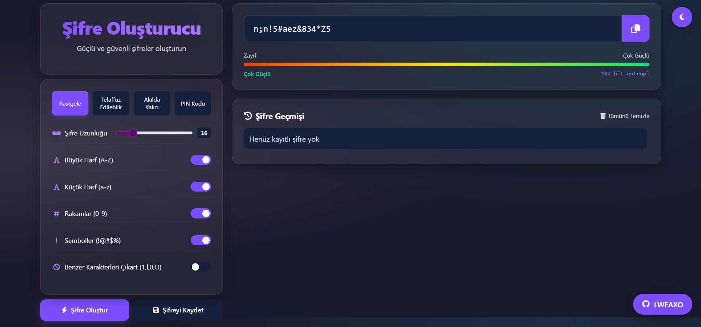
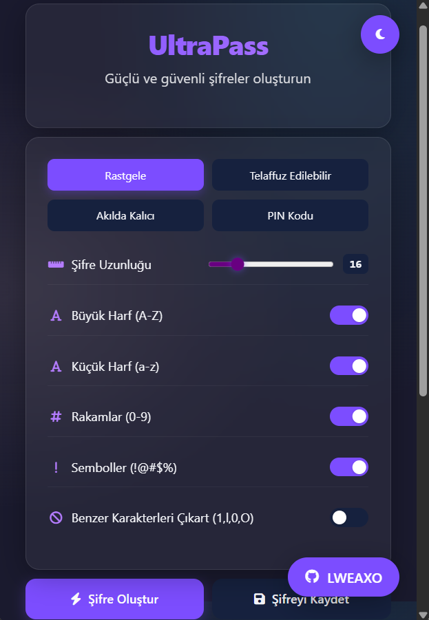

# 🔐 UltraPass - Advanced Password Generator



Modern, responsive ve güvenli şifreler oluşturmak için gelişmiş bir araç. Karanlık/aydınlık mod desteği, çoklu şifre türleri ve şifre geçmişi yönetimi sunar.

## 🚀 Özellikler

- ✨ 4 farklı şifre türü (Rastgele, Telaffuz Edilebilir, Akılda Kalıcı, PIN)
- 🌗 Karanlık/Aydınlık mod geçişi
- 📊 Şifre güç analizi (Entropi hesaplama)
- 📋 Şifre geçmişi ve yönetimi
- 📱 Tamamen responsive tasarım
- 🛡️ Kriptografik güvenlik (window.crypto API)

## 🖥️ Kurulum

Projeyi yerel makinenizde çalıştırmak için:

1. Repoyu klonlayın:
```bash
git clone https://github.com/LWEAXO/UltraPass.git
```
2. `index.html` dosyasını tarayıcınızda açın:
```bash
cd UltraPass
xdg-open index.html  # Linux
start index.html     # Windows
open index.html      # Mac
```

## 📦 Kullanım

[](https://yakında)

## 🛠️ Teknoloji Stacki


## 📝 Özelleştirme

`style.css` dosyasındaki CSS değişkenlerini değiştirerek renk temasını özelleştirebilirsiniz:

```css
:root {
  --primary: #7c4dff;
  --bg: #1a1a2e;
  --text: #f5f6fa;
  /* Diğer değişkenler... */
}
```

## 📱 Responsive Görünüm

| PC | Mobil |
|----|-------|
|  |  |

## 🎨 Renk Paleti

| Renk | Kodu |
|------|------|
| Ana Renk | `#7c4dff` |
| Karanlık Arkaplan | `#1a1a2e` |
| Başarı | `#00e676` |
| Uyarı | `#ffea00` |
| Hata | `#ff3d00` |

## 🤝 Katkıda Bulunma

Katkılarınız memnuniyetle karşılanır! İşte adımlar:

1. Forklayın (🔱)
2. Yeni branch oluşturun (`git checkout -b feature/AmazingFeature`)
3. Değişikliklerinizi commit edin (`git commit -m 'Add some AmazingFeature'`)
4. Pushlayın (`git push origin feature/AmazingFeature`)
5. Pull Request açın

## 📜 Lisans

MIT Lisansı - Detaylar için [LICENSE](LICENSE) dosyasına bakın.

[](LICENSE)

## ✨ Teşekkürler

Bu projeyi kullandığınız için teşekkür ederiz! Yıldız vererek ⭐ destek olabilirsiniz.

[](https://github.com/LWEAXO/UltraPass/stargazers)

## 📞 İletişim

[](https://discord.com/users/1015356240492245054)
[](https://instagram.com/)
---